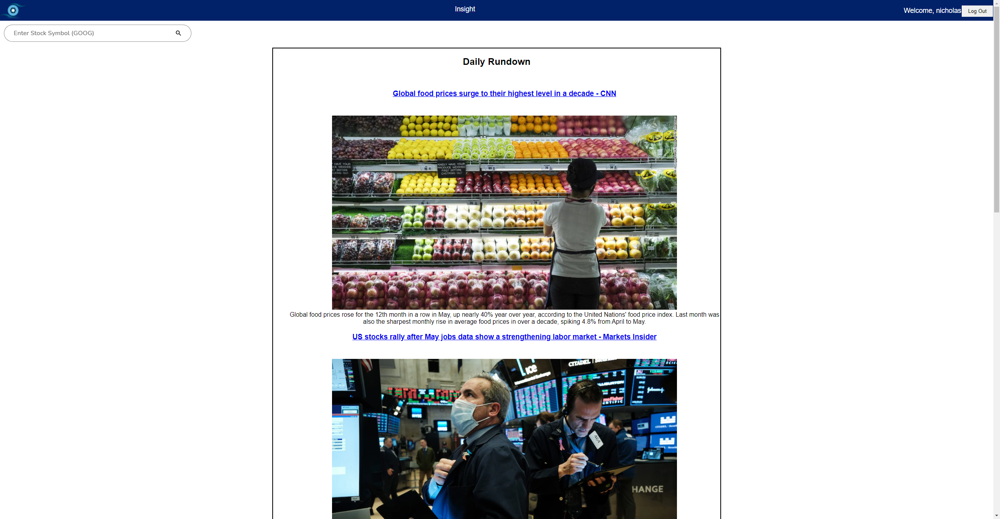

# Insight

[Backend Repo](https://github.com/nicholascrandall/Insight_API)

[Heroku Deployment](https://dashboard.heroku.com/apps/insight-nc)

Insight is a Full Stack Portfolio Tracker that gives you all the information you need to manage your assets and grow your wealth!

## MVP
This app will allow you to:
- Securely register an account for free
- Log in/Log out
- All your information is private and secure, nobody else can see your user
- Users can research US stocks by entering the stock ticker into our search bar
- At our homepage, you'll see a list of today's top financial news articles which you can read a description of or visit the article directly.
- Stock data will be obtained through [Alphavantage API](https://www.alphavantage.co/documentation/)
- Frontend will be done in React, with backend in Flask

## Stretch Goals 
- Cryptocurrency support
- Discord bot made in Python that allows you to query Insight API
- The ability to add asset accounts to your Insight account
- View total net worth
- View performance by account or by individual stock
- The ability to buy and sell stocks directly through insight